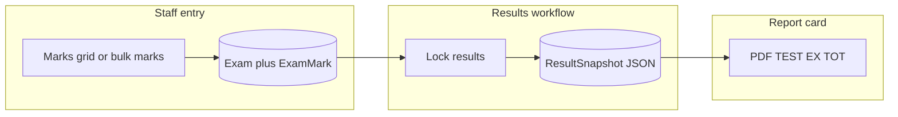

# Exams, marks, and report cards

This document explains how **continuous assessment (Test)** and **term exams (Ex)** are stored, how they flow into **locked results** and **published report cards**, and what is **not** connected today.

## Report card PDF columns

The report card builder ([`src/modules/exams/report-card-pdf.ts`](../src/modules/exams/report-card-pdf.ts)) reads each subject’s `exams` array from **`ResultSnapshot.payload`** (JSON stored when results are locked).

For each subject:

| PDF column | Source |
|------------|--------|
| **TEST** | Marks from the exam with `examType === 'CAT'` (class test / continuous assessment). |
| **EX** | Marks from the exam with `examType === 'EXAM'` (end-of-term exam). |
| **TOT** | Sum of the two `marksObtained` values when present. |

The snapshot is built in **`ExamsService.buildStudentSnapshot`** ([`exams.service.ts`](../src/modules/exams/exams.service.ts)) when **`lockResults`** runs: it loads all active `Exam` rows for the term and class, joins `ExamMark` per student, groups by subject, and attaches CAT vs EXAM into `subject.exams`.



## Data model

Defined in [`prisma/schema.prisma`](../prisma/schema.prisma):

- **`Exam`**: Scoped to tenant, academic year, term, class, and subject. Each row has **`examType`**: `CAT` or `EXAM`, plus `totalMarks`, `weight`, `name`, etc.
- **`ExamMark`**: One row per `(examId, studentId)` with **`marksObtained`** (integer).

```prisma
enum ExamType {
  CAT
  EXAM
}
```

## How marks are recorded

### 1. Class marks grid (main path for Test + Exam columns)

- **Frontend**: `smart-school-fn` — [`class-marks-page.tsx`](../../smart-school-fn/src/pages/class-marks-page.tsx) loads the grid and saves via **`saveMarksGridApi`**.
- **Backend**: **`ExamsService.saveMarksGrid`** — for each student/subject entry:
  - **`testMarks`** → upsert **`ExamMark`** on the **CAT** exam for that subject. If no CAT exam exists, it creates an **`Exam`** with name `"Test"`.
  - **`examMarks`** → upsert **`ExamMark`** on the **EXAM** exam. If missing, creates **`Exam`** with name `"Exam"`.

So in the UI, “test” / continuous assessment maps to **`CAT`**; “exam” maps to **`EXAM`**.

### 2. Per-exam bulk marks

- **Route**: `POST /exams/:examId/marks/bulk` (permission **`exam_marks.manage`**).
- **Implementation**: **`ExamsService.bulkSaveMarks`** — upserts **`ExamMark`** for the given **`examId`**. Same underlying storage as the grid.

### 3. Lock and publish

- **`lockResults`**: Requires every enrolled student to have a mark on every exam in scope for that term/class, then creates one **`ResultSnapshot`** per student with the computed payload.
- **`publishResults`**: Updates snapshot status to published; the JSON payload does not change.

## What does not feed the official report card today

- **Student Assessments** (online attempts, submit via `/assessment-attempts/...`) use the **assessments** module and **`AssessmentAttempt`**. They are **not** written into **`Exam`** / **`ExamMark`** as part of the results snapshot pipeline.
- **LMS** course assignments and submissions are **not** linked to **`ExamMark`** in the exams module.

Official report card marks are **entered by staff** through the exams/marks flows above. Automatically pushing online quiz scores into CAT/EX would be a **separate integration** (for example: write **`ExamMark`** or extend **`buildStudentSnapshot`**).

## Gaps vs a full paper-style form

- **Second TEST/EX/TOT block** on the PDF is shown as placeholders until a “second sitting” (or similar) exists in the data model and snapshot.
- **Lates / Absences** on the PDF are placeholders unless attendance (or other metadata) is added to the snapshot payload.
- **Default names**: the grid creates exams named `"Test"` and `"Exam"`. Custom titles are possible via **`Exam.name`** when exams are created or edited outside the grid.

## Summary

| Concept | In the database | Report card column |
|--------|------------------|---------------------|
| Class test / CAT | `Exam.examType = CAT` + `ExamMark` | TEST |
| Term exam | `Exam.examType = EXAM` + `ExamMark` | EX |
| Total | Sum of the two marks | TOT |
| Online assessment module | Separate tables | Not used for this PDF today |

## Related files

| Area | File |
|------|------|
| PDF layout | [`src/modules/exams/report-card-pdf.ts`](../src/modules/exams/report-card-pdf.ts) |
| Snapshot build, lock, publish | [`src/modules/exams/exams.service.ts`](../src/modules/exams/exams.service.ts) |
| Marks grid save | `saveMarksGrid` in `exams.service.ts` |
| Routes | [`src/modules/exams/exams.routes.ts`](../src/modules/exams/exams.routes.ts) |
